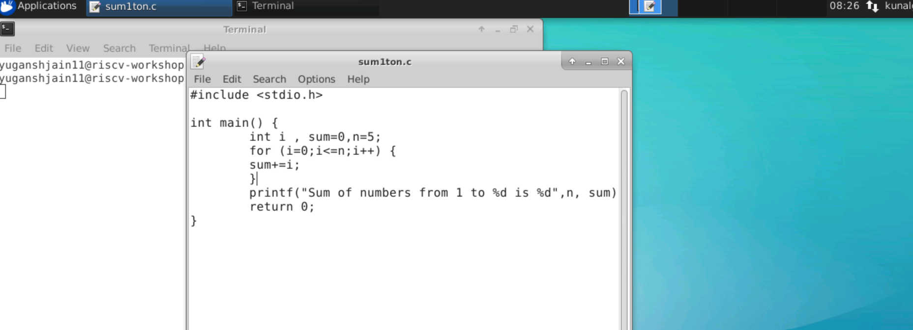
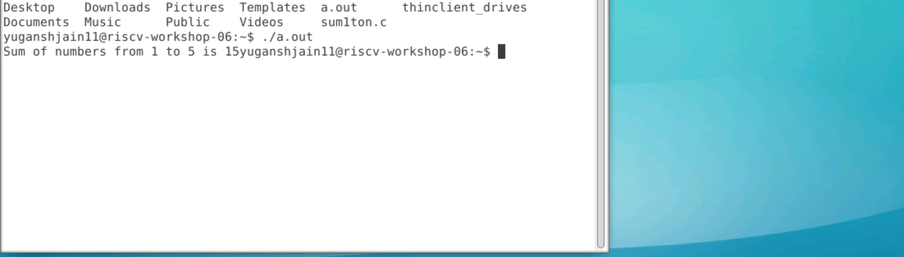
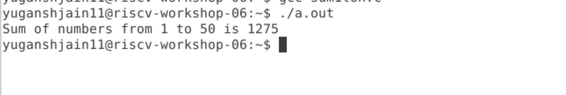

# RISC-V based MYTH Workshop - Building a RISC-V Core using TL-Verilog
5-day RISC-V based CPU Core Design MYTH (Microprocessor for You in Thirty Hours) Workshop, offered by for **VLSI System Design (VSD) and Redwood EDA.**
The basic RISC-V ISA was studied & a simple RISC-V core with base instruction set was implemented. Under the software section, the programming languages that have been used are C, Assembly language and some Pseudo codes. The RISC-V CPU Core has been designed with the help of **Transaction Level Verilog(TL-Verilog) in addition with the Makerchip IDE Platform.**

## Labwork for RISC-V software toolchain

Program to compute sum of 1 to N
```
cd
leafpad sum1ton.c
gcc sum1ton.c
./a.out
```
Code :



Output :




