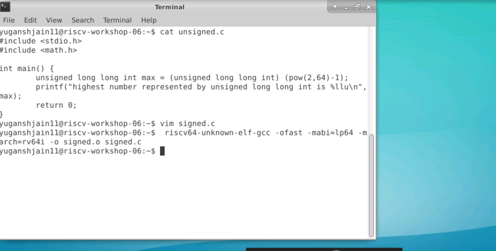
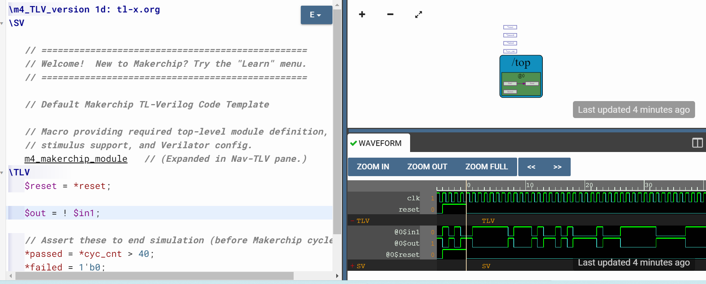
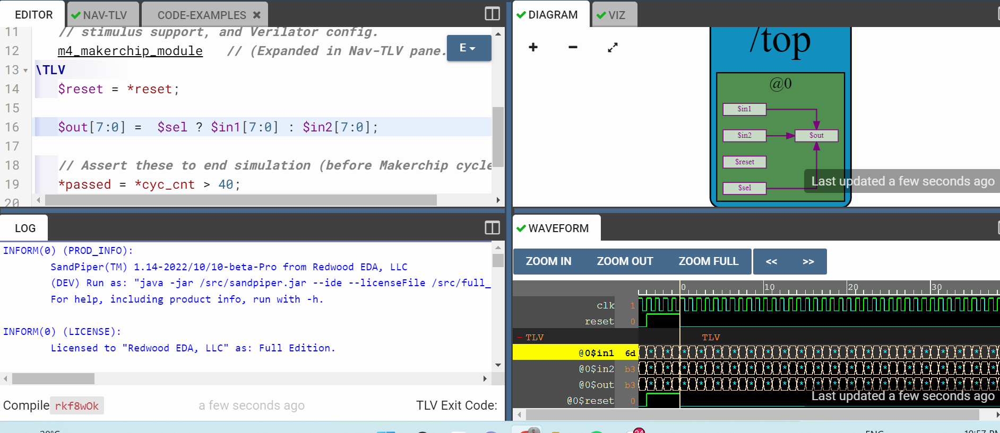

# RISC-V based MYTH  - Building a RISC-V Core using TL-Verilog
RISC-V based CPU Core Design MYTH , offered by for **VLSI System Design (VSD) and Redwood EDA.**
The basic RISC-V ISA was studied & a simple RISC-V core with base instruction set was implemented. Under the software section, the programming languages that have been used are C, Assembly language and some Pseudo codes. The RISC-V CPU Core has been designed with the help of **Transaction Level Verilog(TL-Verilog) in addition with the Makerchip IDE Platform.**

## 1. Labwork for RISC-V software toolchain

### Program to compute sum of 1 to N
```
cd
leafpad sum1ton.c
gcc sum1ton.c
./a.out
```
Code :


Output :


### RISC-V gcc compile and Disassemble
We will run the same sum1ton.c program using RISC-V simulator
First we will compile it with RISC-V gcc compiler

```
riscv64-unknown-elf-gcc -o1 -mabi=lp64 -march=rv64i -o sum1ton.o sum1ton.c
riscv64-unknown-elf-gcc -ofast -mabi=lp64 -march=rv64i -o sum1ton.o sum1ton.c
```

It will generate file sum1ton.o

Now we will see the assembly code for the sum1ton.c file
new terminal

```
riscv64-unknown-elf-objdump -d sum1ton.o
riscv64-unknown-elf-objdump -d sum1ton.o | less
/main
```


check number of instructions


### Spike simulation and Debug

We are doing ./a.out for the gcc compiler to check the output.
Same thing is done in RISK-V using spike
```
spike pk sum1ton.o
```


Open the objectdump if we want to debug using *riscv64-unknown-elf-objdump -d sum1ton.o | less*

To open debugger
```
spike -d pk sum1ton.o
```
To run instructions from 0 to specific like 100b0 pc


To view the contents of register


Press enter to run next instruction


### Signed and Unsigned numbers:
Write this code in vim
 
 
 Then run
 ```
 riscv64-unknown-elf-gcc -ofast -mabi=lp64 -march=rv64i -o unsigned.o unsigned.c
 spike pk unsigned.o
 ```
  
  
  
    
  
  
  

  ## 2. ABI and Basic verification Flow
  
 ### New Algorithm for sum 1 to N using ASM language
 
 Write these two codes:
 
 
 
 
 
 Review ASM function calls
 
 Now for compilation and simulation run these.
 
 ```
 riscv64-unknown-elf-gcc -ofast -mabi=lp64 -march=rv64i -o 1to9_custom.o 1to9_custom.c load.S
 spike pk 1to9_custom.o
 riscv64-unknown-elf-objdump -d 1to9_custom.o | less 
 ```
  
  
  
  
  
  
  

## 3. Digital logic with TL-verilog and makerchip


1. Inverter



2. Vector


3. MUX




### Combinational Calculator

This circuit implements a calculator that can perform +,-,/,* on two input values.


Free running counter:


Sequential logic :


